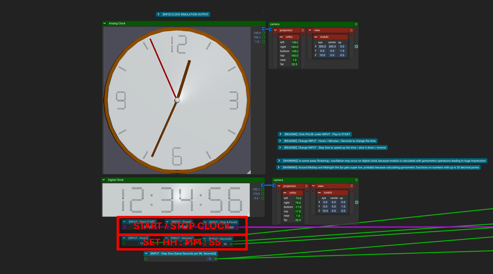
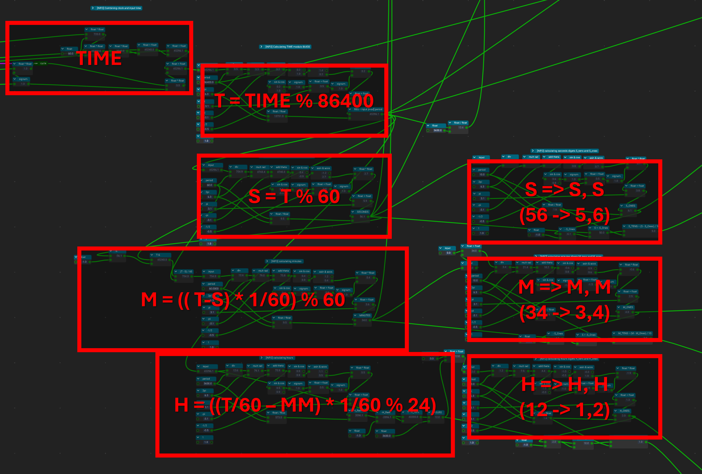
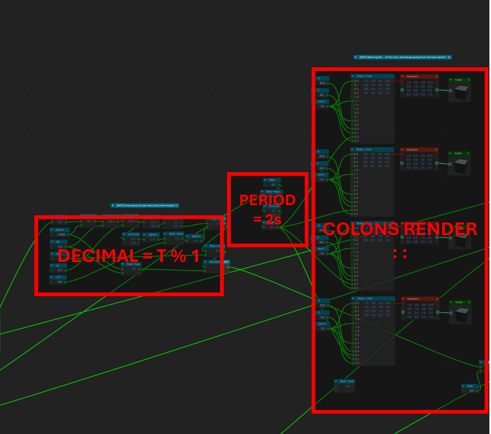
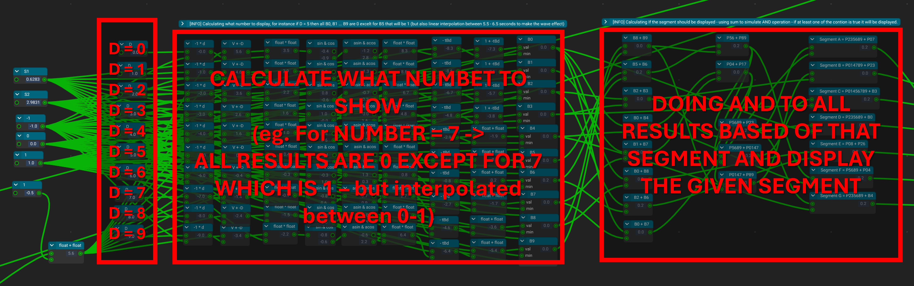
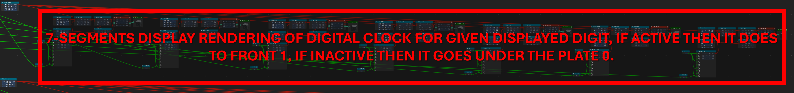
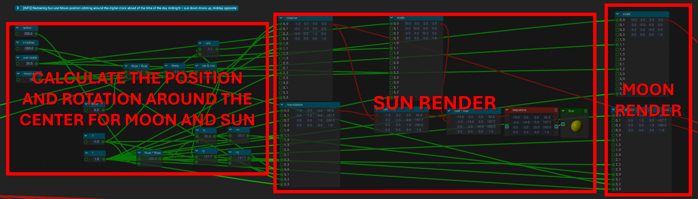
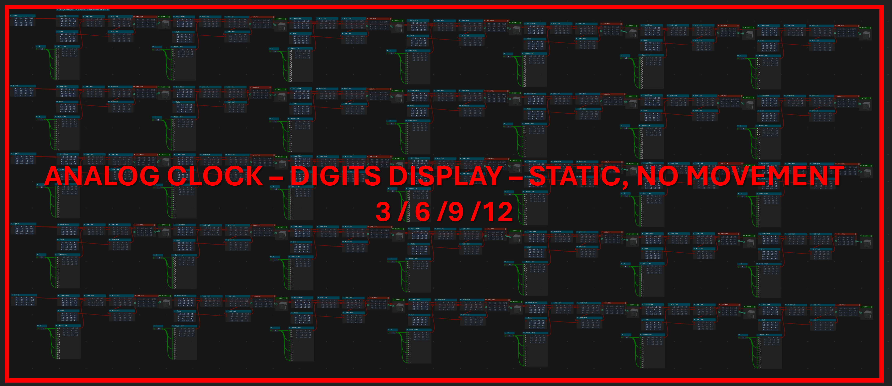
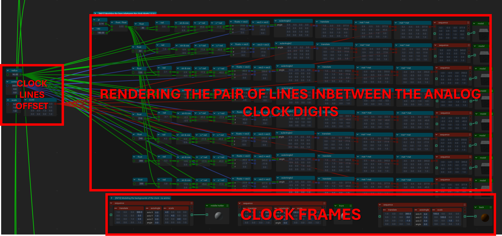
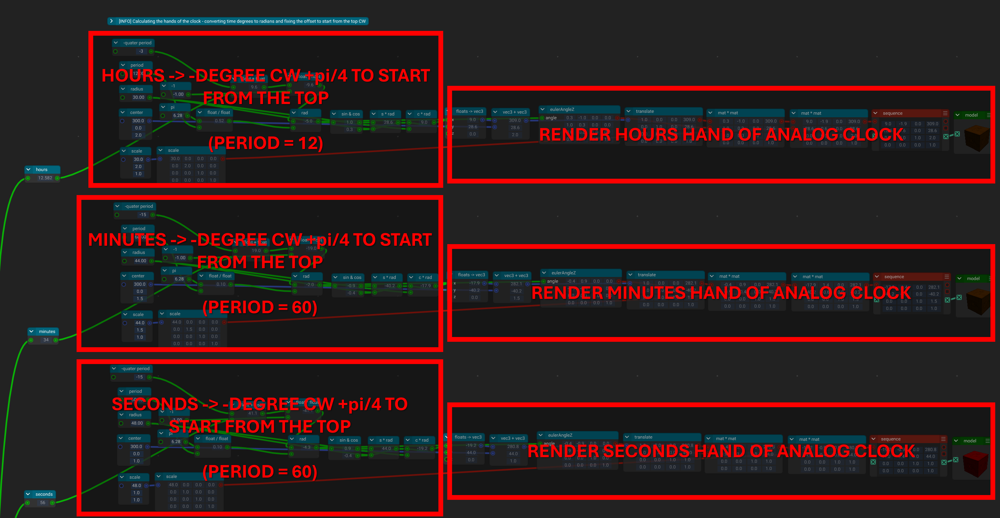

# I3T Digital & Analog Clock

## How to run it

* Open the scene `clock.scene` in [I3T](https://i3t-tool.org/)
* Click the **[INPUT - Play]** button (Pulse) to start the clock.
* To pause the clock, click **[INPUT - Pause]**, and to reset it, click **[INPUT - Stop & Reset]**.
* You can also change the starting time under **[INPUT - Hours/Minutes/Seconds]**.
* To change the speed of the clock, adjust the **[INPUT - Step size per second]**.

---

## How it works
[DESMOS demo: goniometric functions -> modulo](https://www.desmos.com/calculator/i09n8snxir)

### 1. Main View

### 2. Modulos Logic

### 3. Blinking Colons

### 4. Digit Bits Map

### 5. Final Digit Rendering

### 6. Day/Night Cycle (Sun & Moon)

### 7. Analog Clock: Digits

### 8. Analog Clock: Lines

### 9. Analog Clock: Hands

